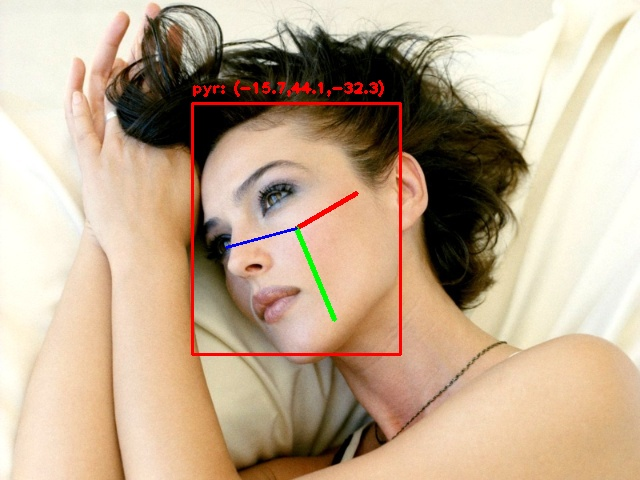
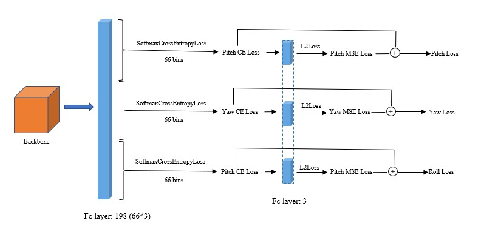

## Optim_Hopenet Head Pose Estimation 


### Environment
- mxnet 1.5.0
- gluon-cv 0.5.0

### Optim_net

> Backbone: [MobileNetv2](https://arxiv.org/abs/1801.04381), [MobileNetv3](https://arxiv.org/abs/1905.02244) (Implement in gluon-cv)

### Preparation
assume you are in the directory *`$Optim_Hopenet/`*.
1. download [300W_LP](http://www.cbsr.ia.ac.cn/users/xiangyuzhu/projects/3DDFA/main.htm) and [AFLW_2000-3D](http://www.cbsr.ia.ac.cn/users/xiangyuzhu/projects/3DDFA/main.htm)
2. unzip 
3. get 'pitch, yaw ,roll ' from annotation file
```shell
# change the dataset path to your path
python data/gen_pose.py
```

### Train
```shell
python train.py --bs 128 --lr 0.001 --alpha 1 --lr_type cos --version small --width_mult 1 --use_fc 1 --net v3 --gpu 0 --prefix test
```

|      Backone      | MAE(alpha=1) | MAE(alpha=2) |  Mb  |
| :---------------: | :----------: | :----------: | :--: |
|   MobileFaceNet   |    6.760     |    6.876     | 4.1  |
|    MobileNetv2    |    6.510     |    6.549     | 9.8  |
| MobileNetv3 small |    6.660     |    6.706     | 7.5  |
| MobileNetv3 large |    6.293     |    6.145     | 17.5 |


### Test
```shell
python test.py --test_type image --image test_res/test.jpg
```


### [Convert2Caffe](./mxnet2caffe/README.md)
```
test: python mxnet2caffe/inference.py
```

### References:
```shell
@InProceedings{Ruiz_2018_CVPR_Workshops,
author = {Ruiz, Nataniel and Chong, Eunji and Rehg, James M.},
title = {Fine-Grained Head Pose Estimation Without Keypoints},
booktitle = {The IEEE Conference on Computer Vision and Pattern Recognition (CVPR) Workshops},
month = {June},
year = {2018}
}
```